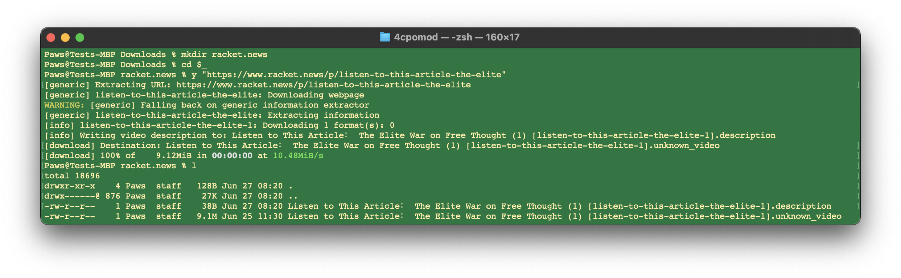
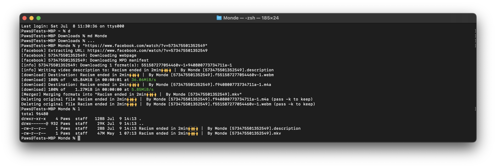

# vid-dl

_Instruction, shortcuts, and examples._

**Written for the macOS platform; ought to work for GNU/Linux users as well.**

Windows instructions can be written — if someone would like to fund the work.

## Ever see something and think, “that won’t live long on the net.” 

[yt-dlp](https://github.com/yt-dlp/yt-dlp#readme) is a tool enabling you to locally store a backup copy of a video from a [wide variety](https://github.com/yt-dlp/yt-dlp/blob/master/supportedsites.md) of video sharing sites, not just YouTube. 

### How do I do that?
Through yt-dlp - an open source command line software tool you are free to use, examine, extend, and share with others. Command line means you’ll have to use [Terminal](https://support.apple.com/guide/terminal/welcome/mac), unless you utilize a GUI front-end.

## Install: 
> Note: on some computer keyboards the [return] key is labeled [enter].

[Open a Terminal](https://search.brave.com/search?q=how+to+open+terminal+on+mac):

Copy each line. Paste each into the terminal; and press return after pasting each of the individual following three lines:
```
mkdir -p ~/.local/bin/
```
```
curl -L https://github.com/yt-dlp/yt-dlp/releases/latest/download/yt-dlp -o ~/.local/bin/yt-dlp
```
```
chmod +x ~/.local/bin/yt-dlp
```
Else, follow any of the install options from the offical [yt-dlp](https://github.com/yt-dlp/yt-dlp#installation) project page and then, click back to this tutorial.

### Install keyboard shortcuts:
Copy the following command and paste it into the Terminal window.
```
cat>>~/.zshrc
```
Press [return] 

Copy the following textblock and paste it into the Terminal:
```
export PATH=~/.local/bin:$PATH
alias yup='yt-dlp -U'
alias y='~/.local/bin/yt-dlp --write-description'
alias l='ls -lh'
alias la='ls -alh'
alias ..='cd ..'
alias d='cd ~/Downloads'
alias md='mkdir'
alias ...='cd $_'
```
Press [return].

The following steps require you to hold down two keyboard keys at once.

* Press, at the same time, the keyboard keys: [control] and [D]. // appends the lines (above) to to your [.zshrc file](https://search.brave.com/search?q=what+is+a+.zshrc+file&source=desktop&conversation=bae7807b9a549037e86918&summary=1).
* Again, press: [control] and [D]. // In this context, Terminal processes your input as an [EOT](https://en.wikipedia.org/wiki/End-of-Transmission_character), not [EOF](https://en.wikipedia.org/wiki/End-of-file) as above, thus the shell session is ended.

> Note: on some computer keyboards [control] is abbreviated [ctrl]. 
- - -
## Now let's try it!
Launch a new Terminal window (Tap or click the Shell menu > New Window > New Window with Profile - Basic); alternatively: press, at the same time, the keyboard keys: [command] and [N]. // either method opens a new Terminal window with a fresh shell session — one where the aliases defined in .zshrc are ready to go.

> “What's a shell?” In computing lingo, a shell is an interface to your computer operating system's [user space](https://techterms.com/definition/user_space). 

### Usage
Now that you have yt-dlp installed and the keyboard shorcuts available:
* Start by typing: d[return]. // this will call up your computer account's Downloads directory (note: the word 'directory' is synonymous with the word Folder).

If you don't already have a shell interface to your computer launch Terminal in order to gain one then, type:
```
d
```
You should now see Downloads listed in your command prompt.

If nothing is happening after you type the command then remember to press the [return] key at the end of the command.  
* Next: type y followed by a space, followed by a quotation mark ", followed by the web address containing the video, followed by another quotation mark ", and then press [return]. // your computer should now be downloading the video along with a description file based upon the video's published description—if a description was published with the video.

Let's download a video:
```
y "https://youtu.be/Li_MGFRNqOE"
```
To access any of the videos you've downloaded simply launch Finder and click on your Downloads folder. Any and all of the downloaded video content will be in that folder unless you moved them or encountered an error. If you failed to type d[return] prior to typing y "specific_video_website_address"[return] then the video may be in your home directory. To check your home directory in Finder: click the Go menu and select Home.

#### Addendum: 
Sometimes downloading a video from 𝕏 doesn't work because the default filename assigned is the full tweet — which often is too long to serve as a filename. In this situation add `--id` after the `y ` and before the url: ex. `y --id "https://x.com/FLSurgeonGen/status/1636707603915980803"` to name the video file after the tweet id.

## Examples:



## Updating:
Let's say you find the tool no longer working. Have you updated it lately? 
Type:
```
yup
```
Followed by [return] or [enter] (however it's labeled upon your keyboard).

That's all there is to it. Take care folks!

# Playing downloaded files

## for macOS
Recommending [IINA](https://iina.io/)

## for Windows, GNU/Linux, &c.
Recommending [VLC](https://www.videolan.org/vlc/)
